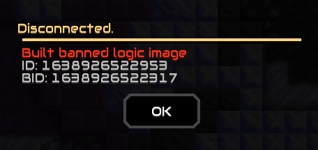

# THIS PLUGIN HAS BEEN DEPRECATED! THE API REQUIRED TO RUN THIS PLUGIN HS BEEN SHUT DOWN!
## Use the newer version of this plugin found [here](https://github.com/L0615T1C5-216AC-9437/BannedMindustryImage).

# GlobalImageBan
A mindustry plugin that checks if a image is banned. No more nsfw (hopefully)

 **ATTENTION:**
1) We need people to submit NSFW Schematics in the [BMI](https://discord.gg/v7SyYd2D3y) server (Only 18+ Allowed). The more submissions we get the more NSFW get blocked.
2) The api uses HTTP, not HTTPS, please refrain from attempting to access the api with https requests.

## Installation Guide
1. Download the latest mod verion in [#Releases](https://github.com/L0615T1C5-216AC-9437/MaxRateCalculator/releases).  
2. Go to your server's directory \ config \ mods
3. Move the mod (`Jar` file) into the mods folder  
4. Restart the server.
5. Use the `mods` command to list all mods. If you see GIB as a mod, GIB was successfully installed.
## Usage
The plugin will scan the code of logic blocks, only when placed, for `drawflush` which signifies the code prints to a screen.  
The code is then hashed and sent to `http://c-n.ddns.net:9999` to see if the hash is banned.  
If the hash is banned, two things can happen detepding on settings:  
1. (Default) Everyone *except* for the person placing the block (player 1) will receive a message saying player 1 is placing NSFW @ (X,Y)
2. Player placing the block will b e kicked for 3h automatically (See below)
  

## Settings  
* `gib_complexSearch` (Boolean): If true, each drawflush will be checked individually.  
default: `false`  
* `gib_NudityOnly` (Boolean): If true, will only respond to code flagged as containing nunity.  
default: `false`  
* `gib_KickBanMessage` (String): What message to send before the `ID: ... \nBID: ... \nIf you think this was a error...` message.  
default: `[scarlet]Built banned logic image`  
* `gib_BanOnHit` (Boolean): If true, will ban user immediately upon hit. Will contain gib_KickBanMessage, ID, BID and link to BMI.  
default: `false`  
* `gib_KickOnHit` (Boolean): If true, will kick user immediately upon hit. Will contain gib_KickBanMessage, ID, BID and link to BMI.  
default: `false`  
* `gib_BroadcastTimeout` (Int): How often, in millis, the server will broadcast when a placer is building nsfw.  
default: `2000`  
* `gib_ConnectionTimeout` (Int): How long, in millis, the server will wait for a http response before giving up. Increase if you have a very high ping to c-n.ddns.net  
default: `1000`  
*Note: c-n.ddns.net does not respond to pings.*  
* `gib_KickDuration` (Int): How many minutes the player will kick be for.  
default: `180`  

## Commands  
`gibconfig`: Same as `config` but for GIB settings.  
`gibclearcache`: Clears the hash cache
## RPC Info
Rate Limit: A maximum of 100 Requests every 30s
